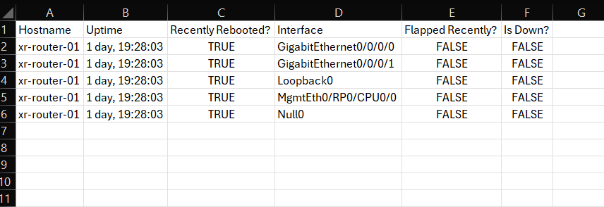
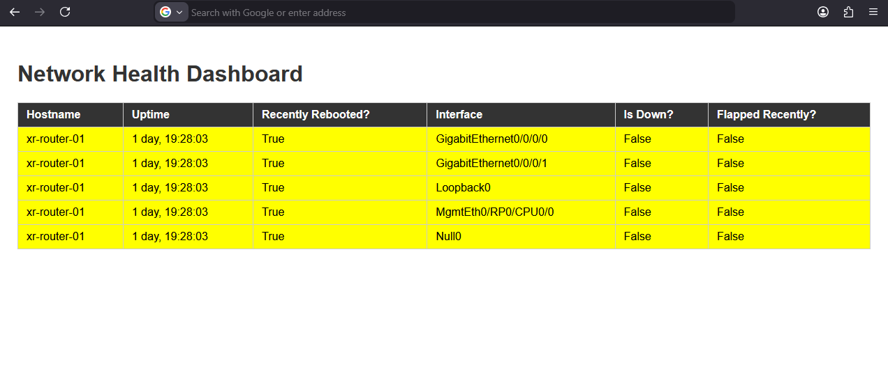
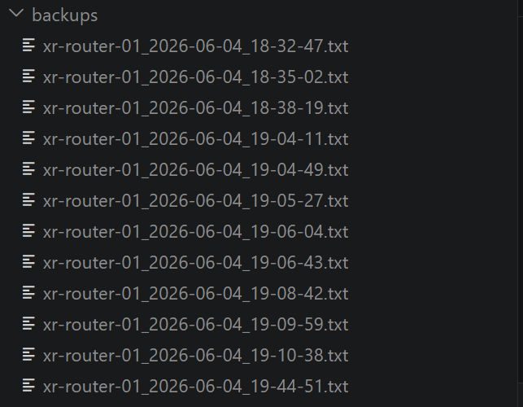
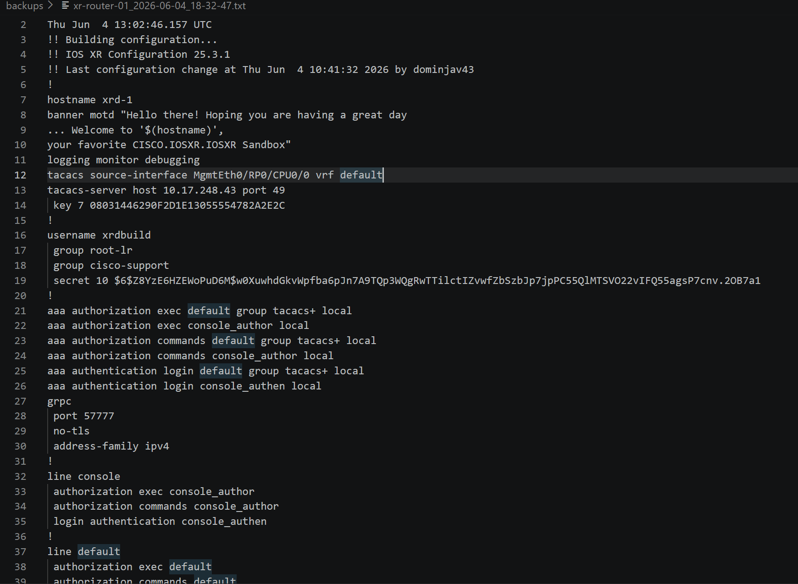

# Project 13 — Network Automation Platform

A multi-script platform for network device health monitoring and automated config backups.

---

## Stage 1 — Network Health Dashboard

Probes network devices and generates a color-coded health report in both CSV and HTML format.

### What it does
- Reads a device inventory from `devices.csv`
- Connects to each device via NAPALM using the NETCONF API
- Pulls live interface and device status data
- Flags unhealthy conditions — recently rebooted (uptime < 5 days), interface down, recent flapping
- Outputs results to `output.csv` and a color-coded `health_report.html` dashboard

### How to run
Populate `devices.csv` with your device details:
```
hostname,ip,username,password,driver,netmiko_driver
xr-router-01,sandbox-iosxr-1.cisco.com,USERNAME,PASSWORD,iosxr_netconf,cisco_xr
```
Then run:
```bash
python health_dashboard.py
```

### Sample output
```
Hostname,Uptime,Recently Rebooted?,Interface,Flapped Recently?,Is Down?
xr-router-01,"1 day, 19:28:03",True,GigabitEthernet0/0/0/0,False,False
xr-router-01,"1 day, 19:28:03",True,GigabitEthernet0/0/0/1,False,False
xr-router-01,"1 day, 19:28:03",True,Loopback0,False,False
xr-router-01,"1 day, 19:28:03",True,MgmtEth0/RP0/CPU0/0,False,False
xr-router-01,"1 day, 19:28:03",True,Null0,False,False
```



### Concepts used
- `napalm` — vendor-agnostic network device API (`get_facts`, `get_interfaces`)
- NETCONF — open standard protocol used instead of Cisco's older XML agent
- `jinja2` — HTML report generation from a template
- `csv` — device inventory input and report output
- `datetime.timedelta` — human-readable uptime and flap time conversion
- `try/except/finally` with `connection = None` pattern for safe cleanup
- `if __name__ == "__main__"` — standard script entrypoint pattern

---

## Stage 2 — Scheduled Config Backup

Automatically fetches and saves full running configs from all devices on a 24-hour schedule.

### What it does
- Reads device inventory from `devices.csv`
- Connects to each device via Netmiko (SSH)
- Fetches full running config (`show run all`)
- Saves each backup as a `.txt` file in `backups/` with hostname and timestamp in the filename
- Runs continuously — repeats every 24 hours as long as the script is running

### How to run
```bash
python config_backup.py
```

### Sample output
```
Disconnected!!!
Configs saved in backups/xr-router-01_2026-06-04_19-44-51.txt
```
The generated backup files at an interval of 30 seconds





### Concepts used
- `netmiko` — SSH connection and CLI command execution
- `os.makedirs()` — creates `backups/` directory if it doesn't exist
- `datetime.strftime()` — timestamp formatting for filenames
- Importing from `utility_functions.py` — reusing `read_csv()` across scripts
- `while True` loop with `time.sleep(86400)` — simple 24-hour scheduling